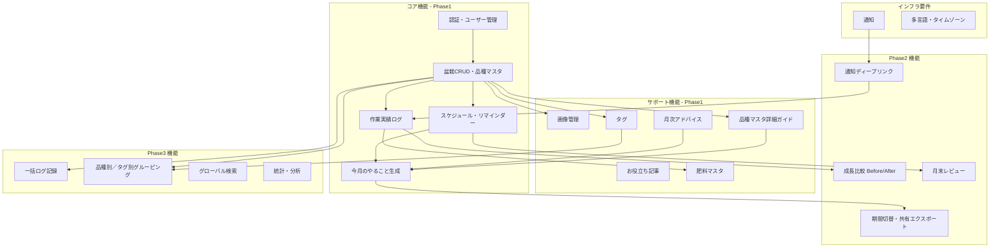
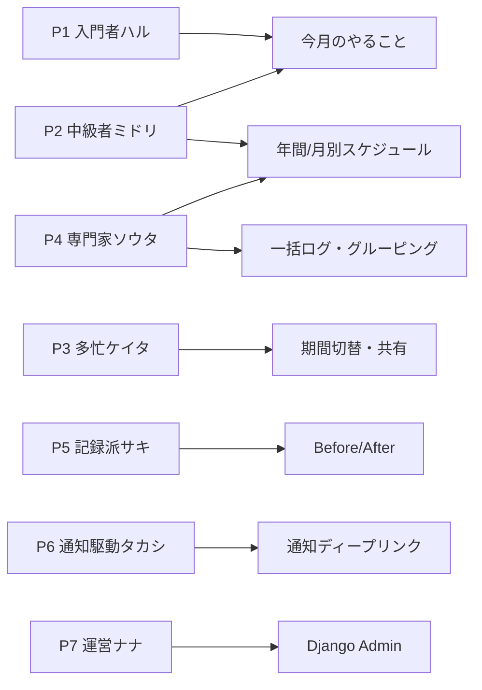
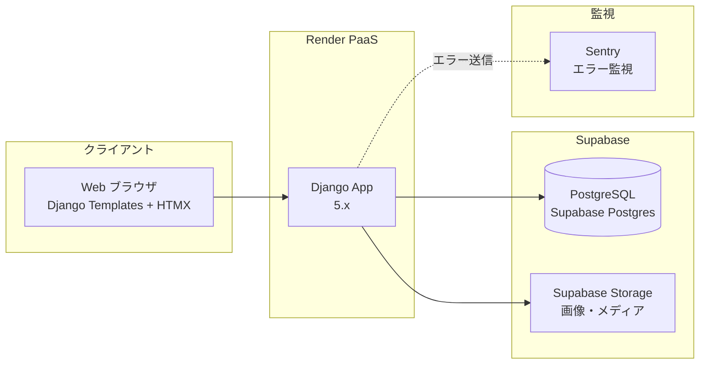
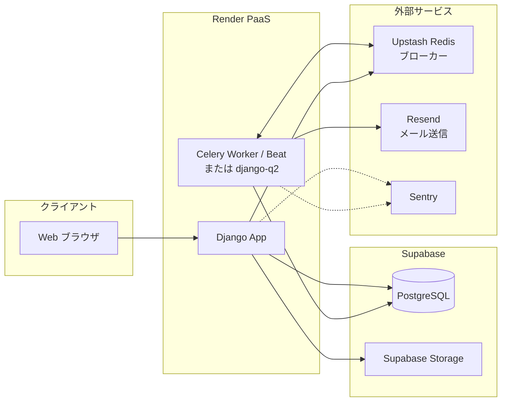
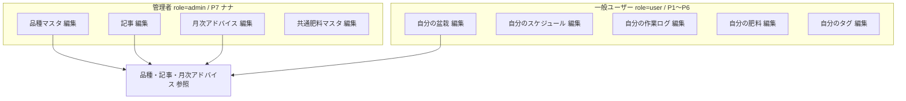
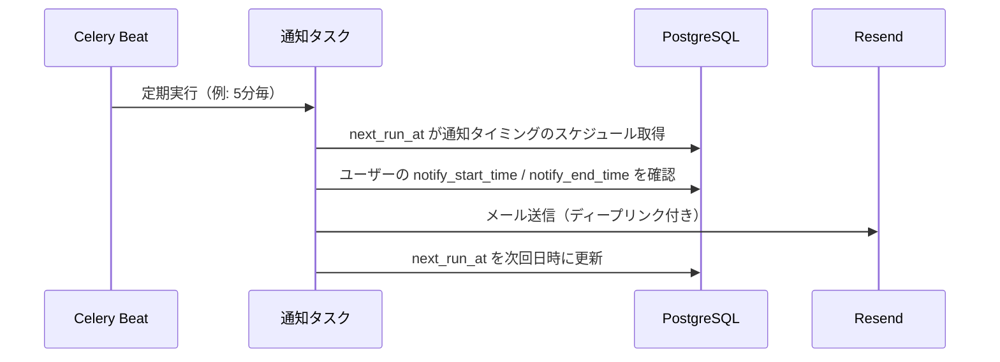
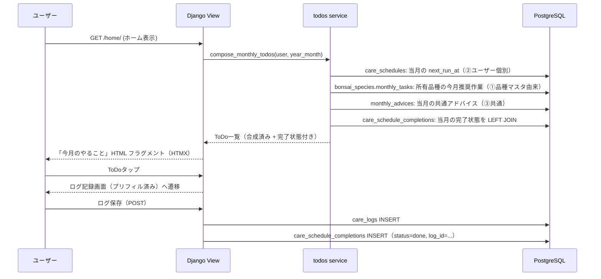
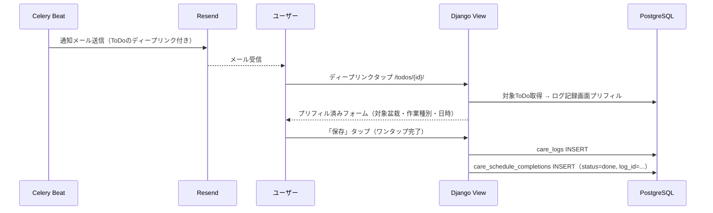
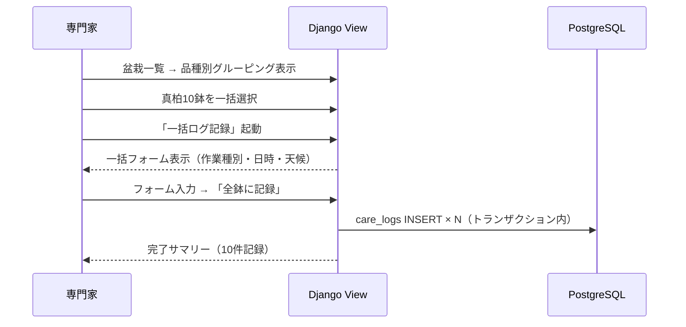

# 盆栽管理アプリ アーキテクチャ図

ペルソナ起点の機能要件は [ユーザーペルソナ.md](./ユーザーペルソナ.md) と [技術要件書.md](./技術要件書.md) §0 を参照。

## 1. 機能領域図

### ペルソナ × 主要機能対応

---

## 2. システム構成図（Django）

### 2.1 MVP 構成（Phase 1）

**MVP では Redis / Celery / メールサービスは導入しない**。画像リサイズは Django プロセス内で同期実行（Pillow）。

### 2.2 Phase 3 拡張構成（通知導入時）

→ 採用判断と段階は [開発前検討事項.md](./開発前検討事項.md) §2.2, §5 を参照。

---

## 3. 権限モデル

---

## 4. スケジュール・通知のシーケンス図（**Phase 3** で実装）

> MVP では通知は実装しない。本シーケンスは Phase 3 の参照設計。

## 5. 「今月のやること」生成シーケンス（P1, P2 中心）

[開発前検討事項.md](./開発前検討事項.md) §10.1 の決定により、**A（オンデマンド計算）+ 完了状態のみ別テーブル `care_schedule_completions`** に保存する方式。サービス層 `apps/schedules/services/todos.py::compose_monthly_todos()` が合成を担う。

## 6. 通知駆動UX シーケンス（P6 タカシ）— **Phase 3** で実装

> MVP では通知機能を提供しないため、本シーケンスは Phase 3 の参照設計。

## 7. 一括ログ記録シーケンス（P4 ソウタ）— **Phase 3** で実装

