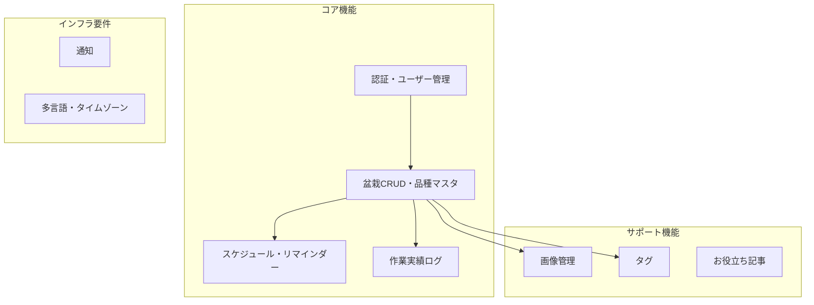
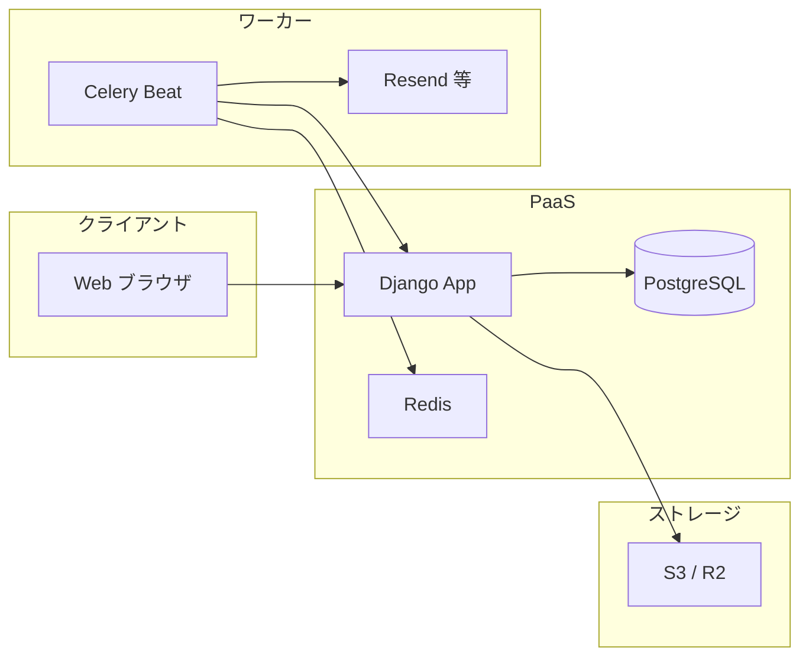
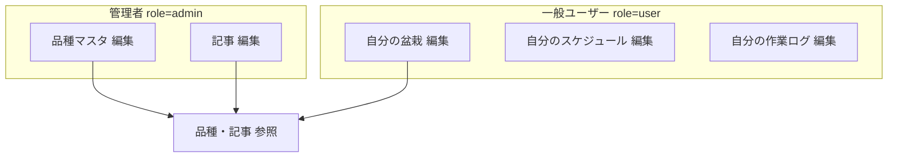
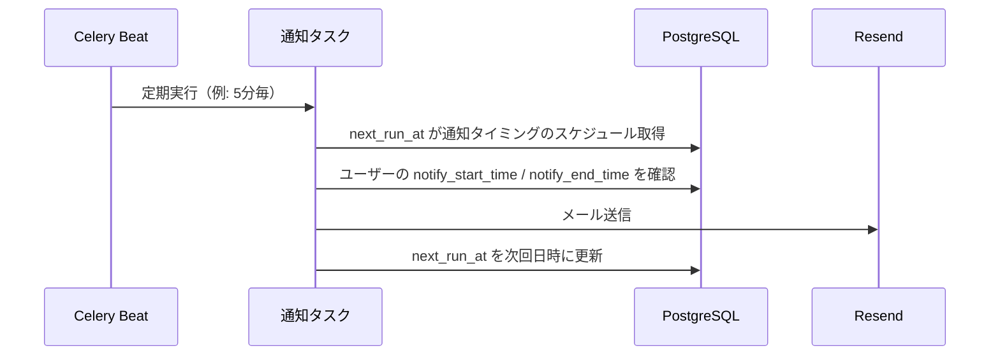

# 盆栽管理アプリ アーキテクチャ図

## 1. 機能領域図

```mermaid
flowchart TB
    subgraph core [コア機能]
        Auth[認証・ユーザー管理]
        Bonsai[盆栽CRUD・品種マスタ]
        Schedule[スケジュール・リマインダー]
        Log[作業実績ログ]
    end
    subgraph support [サポート機能]
        Media[画像管理]
        Tag[タグ]
        Help[お役立ち記事]
    end
    subgraph infra [インフラ要件]
        Notify[通知]
        I18n[多言語・タイムゾーン]
    end
    Auth --> Bonsai
    Bonsai --> Schedule
    Bonsai --> Log
    Bonsai --> Media
    Bonsai --> Tag
```

---

## 2. システム構成図（Django）

```mermaid
flowchart LR
    subgraph client [クライアント]
        Browser[Web ブラウザ]
    end
    subgraph paas [PaaS]
        Django[Django App]
        PG[(PostgreSQL)]
        Redis[Redis]
    end
    subgraph storage [ストレージ]
        S3[S3 / R2]
    end
    subgraph workers [ワーカー]
        Celery[Celery Beat]
        Mail[Resend 等]
    end
    Browser --> Django
    Django --> PG
    Django --> S3
    Celery --> Django
    Celery --> Mail
    Celery --> Redis
```

---

## 3. 権限モデル

```mermaid
flowchart TB
    subgraph admin [管理者 role=admin]
        AdminSpecies[品種マスタ 編集]
        AdminArticles[記事 編集]
    end
    subgraph user [一般ユーザー role=user]
        UserBonsai[自分の盆栽 編集]
        UserSchedule[自分のスケジュール 編集]
        UserLog[自分の作業ログ 編集]
    end
    AdminSpecies --> ReadOnly[品種・記事 参照]
    AdminArticles --> ReadOnly
    UserBonsai --> ReadOnly
```

---

## 4. スケジュール・通知のシーケンス図

```mermaid
sequenceDiagram
    participant Beat as Celery Beat
    participant Task as 通知タスク
    participant DB as PostgreSQL
    participant Mail as Resend
    Beat->>Task: 定期実行（例: 5分毎）
    Task->>DB: next_run_at が通知タイミングのスケジュール取得
    Task->>DB: ユーザーの notify_start_time / notify_end_time を確認
    Task->>Mail: メール送信
    Task->>DB: next_run_at を次回日時に更新
```
