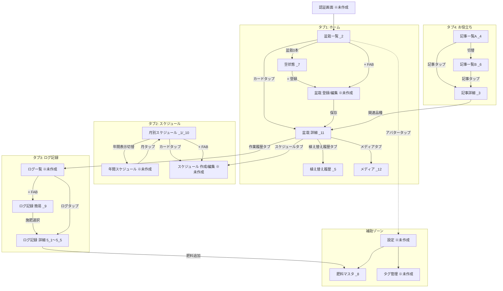

# 盆栽管理アプリ サイトマップ・画面構成図

現在の stitch_20260402 ワイヤーフレーム（17画面）をベースに整理した画面構成です。
未作成の画面（補完候補）は `※未作成` として明示しています。

ペルソナ定義は [ユーザーペルソナ.md](./ユーザーペルソナ.md) を参照。
本サイトマップの設計判断は P1〜P7（入門者ハル／中級者ミドリ／多忙ケイタ／専門家ソウタ／記録派サキ／通知駆動タカシ／運営ナナ）を起点としている。

---

## 1. 全体サイトマップ（階層構造）

```
盆栽管理アプリ
│
├─ [認証ゾーン] ※未作成（補完プロンプトA）
│   ├─ ウェルカム / ログイン選択（**MVP は メール+パスワード / Google OAuth の2系統。Apple Sign In は Phase 2 以降**）
│   ├─ メールログイン
│   ├─ 新規登録（email をログイン ID として使用、`username` は廃止）
│   └─ パスワード再設定
│
└─ [メインゾーン]（要ログイン、ボトムナビ4タブ常設）
    │
    ├─ 🏠 ホーム（タブ1）
    │   ├─ 今月のやること（ToDo セクション）       ← 新設（最上部）
    │   │   ├─ 期間切替: 今月 / 今週 / カスタム期間（留守番・短期確認用）
    │   │   ├─ ToDoカードリスト（チェック → ログ記録へプリフィル遷移）
    │   │   └─ 一括完了 / 共有エクスポート（家族・代理人向け）
    │   ├─ 最近の活動（写真付きタイムライン）       ← 新設（成長実感）
    │   ├─ 盆栽一覧（マイ盆栽）                    … _2
    │   │   ├─ 表示切替: カード / 品種別グルーピング / タグ別
    │   │   └─ 一括選択モード（複数選択 → 一括ログ記録へ）
    │   ├─ 盆栽 空状態                             … _7
    │   ├─ 盆栽 新規登録 / 編集                    … ※未作成（補完プロンプトB）
    │   │   └─ 「品種推奨スケジュールを自動生成」CTA
    │   └─ 盆栽 詳細                               … _11
    │       ├─ タブ: 概要（基本情報＋今月のやること抽出）
    │       ├─ タブ: 作業履歴
    │       ├─ タブ: スケジュール
    │       ├─ タブ: メディア                     → _12 へ
    │       ├─ タブ: 植え替え履歴                 → _5 へ
    │       └─ タブ: 成長比較（Before / After）   ← 新設
    │
    ├─ 📅 スケジュール（タブ2）
    │   ├─ 月別スケジュール                       … _1, _10
    │   │   ├─ フィルタ軸: 作業種別 / 盆栽別 / 品種別 / タグ別
    │   │   └─ 完了状態の表示（済 / 未 / スキップ）
    │   ├─ 年間スケジュール                       … ※未作成（補完プロンプトF）
    │   ├─ 月末レビュー画面                       ← 新設（先月の完了率・振り返り）
    │   ├─ スケジュール 新規作成 / 編集           … ※未作成（補完プロンプトC）
    │   │   └─ 「品種推奨スケジュールから生成」CTA
    │   └─ 植え替え履歴 詳細                      … _5
    │
    ├─ 📝 ログ記録（タブ3）
    │   ├─ 作業ログ一覧（タイムライン）           … ※未作成（補完プロンプトG）
    │   │   └─ 検索・フィルタ・期間絞込
    │   ├─ 作業ログ記録（簡易版）                 … _9
    │   ├─ 作業ログ記録（詳細版・施肥対応）       … 5_1〜5_5
    │   └─ 一括ログ記録（複数盆栽 × 同一作業）    ← 新設（多鉢運用）
    │
    └─ 📚 お役立ち（タブ4）
        ├─ お役立ちトップ                          … _4 と _6 を1案に統合
        ├─ サブカテゴリ
        │   ├─ 作業TIPS（剪定・芽摘み・針金 等）
        │   ├─ 品種ガイド（一覧 → 品種マスタ詳細へ）
        │   ├─ 病害虫対策
        │   └─ ギャラリー（会員作品）
        ├─ 記事詳細                                … _3
        │   └─ 関連品種・関連記事・自分の該当盆栽へ
        └─ 品種マスタ詳細                          ← 新設（両ペルソナの中心画面）
            ├─ 月別 推奨作業カレンダー
            ├─ 特殊作業ガイド（真柏の芽摘み 等）
            ├─ 関連記事
            └─ 自分の該当盆栽一覧

[グローバル要素（全タブ共通）]
├─ ヘッダー検索（盆栽 + 記事 + ログ横断）          ← 新設
├─ 通知ベル → 通知一覧 → ディープリンク先          ← 新設
└─ アバター → ライブラリ／設定                     ← 統合化

[ライブラリ（補助ゾーン・統合）]                    ← 名称変更
├─ メディア（年別ギャラリー）                      … _12
├─ タグ管理                                        … ※未作成（補完プロンプトE）
├─ 肥料マスタ                                      … _8（_8 のボトムナビ「TOOLS」廃止しここへ統合）
└─ 品種マスタ閲覧（管理者は編集も可）              ← 新設

[設定]                                             … ※未作成（補完プロンプトD）
├─ プロフィール
├─ 通知設定
├─ アプリ設定（タイムゾーン / 言語）
├─ アカウント（ログアウト・削除）
└─ 利用規約 / プライバシーポリシー

[通知由来のエントリポイント]                        ← 新設（**Phase 3 で実装**：MVP では通知機能を提供しない）
├─ メール通知タップ → 該当 ToDo（プリフィルされたログ記録）
├─ Webプッシュ → 「今月のやること」内の該当 ToDoカード
└─ 即時記録（ワンタップ完了 → 作業ログ作成）
```

---

## 2. ボトムナビ構成（全画面共通）

| タブ | アイコン | ラベル | ルート画面 | ルート構成 |
|------|---------|-------|-----------|------------|
| 1 | home | ホーム | 「今月のやること」+ 盆栽一覧 | 上部にToDoセクション、下部に既存 _2 |
| 2 | calendar_month | スケジュール | 月別スケジュール | _1, _10 |
| 3 | edit_note | ログ記録 | 作業ログ一覧 | ※未作成（補完プロンプトG）+ 一括記録 |
| 4 | auto_stories | お役立ち | お役立ちトップ | _4 / _6 を統合 |

**統一方針**: _8（肥料登録）の「TOOLS」タブは廃止し、ライブラリ（補助ゾーン・アバターから遷移）に統合する。
グローバル要素として **ヘッダー検索** と **通知ベル** を全画面共通で配置する。

---

## 3. 画面一覧（stitch ワイヤー対応表）

| ID | 画面名 | 種別 | 主な機能 | 関連データ |
|----|--------|------|---------|----------|
| _1 | 月別スケジュール（月内品種別カード） | リスト | 月切替、品種別カード、フィルタチップ、共通ルール表示 | care_schedules, bonsai_plants |
| _2 | 盆栽一覧（マイ盆栽） | ハブ | 検索、状態フィルタ、単独樹＋寄せ植えグループ表示、＋FAB | bonsai_plants, bonsai_groups※ |
| _3 | お役立ち記事 詳細 | コンテンツ | カバー画像、ステップ、関連記事 | help_articles, article_species_relations |
| _4 | お役立ち記事 一覧A | カテゴリTOP | 特集バナー、カテゴリ一覧、最新記事 | help_articles |
| _5 | 植え替え履歴（盆栽別） | サブ詳細 | 最終植え替え、次回目安、用土配合、履歴タイムライン | care_logs（task_type=植え替え）, bonsai_plants |
| _6 | お役立ち記事 一覧B | カテゴリTOP（別案） | コレクション/TIPS/LOGS/SPECIES の4ナビ | help_articles, bonsai_species |
| _7 | 盆栽 空状態 | 空状態 | 「盆栽を登録する」CTA、お役立ち記事への誘導 | （データなし時） |
| _8 | 肥料マスタ 登録/編集 | フォーム | 肥料名、形態（固形/液体）、N-P-K成分比 | fertilizers※新設要 |
| _9 | 作業ログ記録（簡易版） | フォーム | 対象選択、作業種別、日時、気温、天候、メモ、写真、状態評価4段階 | care_logs |
| _10 | 月別スケジュール（_1のバリエーション） | リスト | _1 とほぼ同等 | care_schedules |
| _11 | 盆栽 詳細 | 詳細 | 基本情報、4タブ（作業履歴/スケジュール/メディア/植え替え履歴）、メディア抜粋 | bonsai_plants, care_logs, care_schedules, bonsai_media |
| _12 | メディア（年別ギャラリー） | ギャラリー | 年タブ、月別グルーピング、サムネイル | bonsai_media |
| 5_1 | 作業ログ記録（詳細・施肥-普通） | フォーム | 5段階状態評価＋肥料選択＋N-P-K表示 | care_logs, fertilizers |
| 5_2 | 作業ログ記録（詳細・施肥-要注意） | フォーム | 5_1 の状態評価バリエーション | 同上 |
| 5_3 | 作業ログ記録（詳細・施肥-良好） | フォーム | 同上バリエーション | 同上 |
| 5_4 | 作業ログ記録（詳細・施肥-最高） | フォーム | 同上バリエーション | 同上 |
| 5_5 | 作業ログ記録（詳細・施肥-不調） | フォーム | 同上バリエーション | 同上 |

---

## 4. 画面遷移図（メインフロー）



---

## 5. 主要ユーザーフロー

### フロー1: 初回オンボーディング
```
ログイン → 盆栽一覧（空状態 _7） → 盆栽 登録 ※未作成 → 盆栽 詳細 _11
                                                       → スケジュール作成 ※未作成
```

### フロー2: 日常の作業記録
```
ログ記録タブ → ログ一覧 ※未作成 → + FAB → ログ記録 簡易 _9
                                          → 施肥選択時は詳細版 5_1〜5_5
                                          → 肥料登録 _8（必要時）
                                          → 保存 → ログ一覧
```

### フロー3: スケジュール確認
```
スケジュールタブ → 月別 _1
                  → 年間表示切替 → 年間スケジュール ※未作成
                  → 個別カードタップ → スケジュール編集 ※未作成
```

### フロー4: 盆栽の状態確認・管理
```
ホーム _2 → 盆栽カードタップ → 盆栽詳細 _11
                              → 作業履歴タブ → ログ詳細
                              → スケジュールタブ → スケジュール編集
                              → メディアタブ → 年別ギャラリー _12
                              → 植え替え履歴タブ → 植え替え履歴 _5
```

### フロー5: 学習・参照
```
お役立ちタブ → 記事一覧 _4/_6
              → 記事詳細 _3
              → 関連品種 → 該当する自分の盆栽詳細 _11
```

---

## 6. 各画面の遷移先一覧（詳細表）

| 元画面 | 遷移先 | トリガー |
|-------|-------|---------|
| _2 盆栽一覧 | _11 盆栽詳細 | カードタップ |
| _2 盆栽一覧 | 盆栽登録※ | + FAB |
| _2 盆栽一覧 | _7 空状態 | 盆栽0本時の自動表示 |
| _7 空状態 | 盆栽登録※ | 「盆栽を登録する」CTA |
| _7 空状態 | _4 記事一覧 | 「お役立ち記事を読む」 |
| _11 盆栽詳細 | ログ詳細（作業履歴タブ内） | タブ切替 |
| _11 盆栽詳細 | _12 メディア | メディアタブ |
| _11 盆栽詳細 | _5 植え替え履歴 | 植え替え履歴タブ |
| _11 盆栽詳細 | スケジュール編集※ | スケジュールタブ |
| _1/_10 月別スケジュール | スケジュール編集※ | カードタップ |
| _1/_10 月別スケジュール | 年間スケジュール※ | 年表示切替 |
| _9 ログ記録 簡易 | 5_1〜5_5 ログ記録 詳細 | 「施肥」選択時 |
| 5_1〜5_5 ログ記録 詳細 | _8 肥料マスタ | 「+ 肥料を追加」 |
| _4 記事一覧A | _3 記事詳細 | 記事カードタップ |
| _6 記事一覧B | _3 記事詳細 | 記事カードタップ |
| _3 記事詳細 | _11 盆栽詳細 | 関連品種タップ（自分の盆栽がある場合） |
| _3 記事詳細 | 関連記事 _3 | 関連記事カード |
| 全画面（ヘッダーアバター） | 設定※ | アバタータップ |

---

## 7. 階層深度マップ

```
深度0（タブルート）: _2 / _1 / ログ一覧※ / _4
深度1: _11（盆栽詳細）/ _9（ログ記録）/ _3（記事詳細）/ スケジュール編集※
深度2: _5（植え替え履歴）/ _12（メディア）/ 5_1〜5_5（ログ記録詳細）
深度3: _8（肥料マスタ）
```

戻る導線は基本的に `←` ボタン or ブラウザバック。
タブ切替は深度をリセットせず、各タブが独立した遷移スタックを持つ想定。

---

## 8. 未作成画面リスト（優先度順）

| 優先度 | 画面 | 補完プロンプトID | 必要性 |
|--------|------|----------------|--------|
| 1 | 盆栽 新規登録 / 編集 | B | CRUDの基幹、空状態からの最初の操作 |
| 2 | スケジュール 新規作成 / 編集 | C | 差別化機能のCRUD |
| 3 | 年間スケジュール（モバイル） | F | キラーフィーチャーの本体 |
| 4 | 作業ログ 一覧 | G | _9 への入口がない |
| 5 | 認証画面（ログイン/サインアップ） | A | 初回体験 |
| 6 | 設定画面 | D | 通知設定の置き場所 |
| 7 | タグ管理 | E | 補助機能 |

---

## 9. 構成上の決定事項（要意思決定）

| # | 課題 | 選択肢 |
|---|------|-------|
| 1 | _8 のボトムナビ「TOOLS」 | A: 全画面「お役立ち」に統一<br>B: 4タブ→5タブに拡張<br>C: TOOLS を設定配下に格納 |
| 2 | 寄せ植え（_2 グループ表示） | A: MVPに含める（新テーブル）<br>B: Phase2に延期 |
| 3 | 状態評価の段階数（_9=4段階 / 5_x=5段階） | 5段階に統一推奨 |
| 4 | 年間スケジュールの表示方式 | A: 月カード縦リスト<br>B: 横スクロールタイムライン<br>C: 両方切替可能 |
| 5 | 肥料マスタの管理者 | A: ユーザー個別<br>B: 共通マスタ（Admin編集）<br>C: ハイブリッド |
| 6 | お役立ち記事 一覧の _4 / _6 | どちらか1案に統合 |

---

## 10. ホーム画面の構成方針（ペルソナ評価による補強）

両ペルソナ（初心者・中級者）共通で「アプリを開いた瞬間に今やるべきことが分かる」ことが最重要。
ただし**盆栽の作業粒度は月単位が中心**（剪定時期、芽摘み時期、施肥開始月、植え替え適期など）であるため、
ToDoの単位は「今日／今週」ではなく「**今月のやること**」を採用する。

### ホーム（_2）の改修構成

```
🏠 ホーム
│
├─ ヘッダー
│   ├─ アバター（→ 設定）
│   ├─ タイトル「盆栽管理」
│   └─ 通知ベル
│
├─ ✨ 今月のやること（新セクション・最上部）   ← 新設
│   ├─ 月名表示（例: 「2026年4月のやること」）
│   ├─ 進捗インジケーター（例: 「12件中 5件完了」）
│   ├─ ToDoカードリスト（縦スクロール、未完了→完了の順）
│   │   各カード:
│   │   ├─ 作業種別チップ（潅水/施肥/剪定 等の色付き）
│   │   ├─ 対象盆栽名 + 品種
│   │   ├─ 推奨時期（例: 「上旬まで」「中旬」）
│   │   ├─ 短い説明（例: 「真柏：芽摘みの時期です」）
│   │   ├─ チェックボックス（タップで完了 → ログ記録へ）
│   │   └─ 「詳しく」リンク → 関連お役立ち記事 or 品種詳細へ
│   └─ 「年間スケジュールを見る」リンク → 年間スケジュール画面
│
├─ 検索バー（盆栽を検索）
│
├─ 状態フィルタチップ（全て / 良好 / 要注意 / 不調）
│
├─ 🌳 マイ盆栽一覧（既存 _2 のリスト部分）
│   ├─ 単独樹カード
│   └─ 寄せ植えグループカード
│
└─ + FAB（盆栽を登録）
```

### 「今月のやること」のデータソース

ToDo項目は3種類のソースから合成する:

| ソース | 種類 | 例 |
|--------|------|----|
| **A. ユーザー作成スケジュール** | care_schedules で next_run_at が当月内 | 「黒松 太郎の水やり（毎日）」 |
| **B. 品種マスタ由来の月次推奨作業** | bonsai_species の月別推奨作業（新スキーマ） | 「真柏 雲海：芽摘みの適期です」 |
| **C. 月次共通ルール** | 月次アドバイス（4月の植え替え注意 等） | 「今月は植え替え適期。鉢の状態を確認」 |

→ B と C は**ユーザーが事前にスケジュール作成しなくても自動で表示される**ことが、
両ペルソナの「品種別特殊対応がわからない」課題を解決する核心となる。

### サイトマップ反映後の構造

```
[メインゾーン]
│
├─ 🏠 ホーム
│   ├─ 今月のやること（新セクション）              ← 追加
│   │   ├─ ユーザー作成スケジュール由来
│   │   ├─ 品種マスタ由来の推奨作業（自動）        ← データ拡張要
│   │   └─ 月次共通ルール
│   ├─ 盆栽一覧（既存 _2 のリスト）
│   ├─ 盆栽 空状態（_7）
│   ├─ 盆栽 新規登録/編集 ※未作成
│   └─ 盆栽 詳細 _11
│
├─ 📅 スケジュール
│   ├─ 月別（_1）
│   │   └─ 盆栽別フィルタ追加                       ← 改修
│   ├─ 年間（※未作成・最優先）
│   └─ スケジュール作成
│       └─ 「品種推奨から生成」CTA                  ← 追加
│
├─ 📝 ログ記録（現状維持）
│
└─ 📚 お役立ち
    ├─ 記事一覧（_4/_6 統合）
    ├─ 記事詳細（_3）
    └─ 品種マスタ詳細（新規）                       ← 追加
        ├─ 年間カレンダー
        ├─ 特殊作業ガイド（芽摘み・古葉抜き 等）
        ├─ 関連記事
        └─ 自分の該当盆栽一覧
```

### 完了アクション（ToDo → ログ）の連動

「今月のやること」のチェックボックスをタップしたときの遷移:

```
ToDoカード [✓] タップ
   ↓
作業ログ記録画面（_9 / 5_x）にプリフィル遷移
   - 対象盆栽：自動入力
   - 作業種別：自動入力（潅水/施肥/剪定 等）
   - 日時：当日
   ↓
ユーザーは天候・気温・写真・メモを追加 → 保存
   ↓
ToDo項目が「完了」状態に変化（取り消し線 + 緑チェック）
   ↓
進捗インジケーターが更新
```

### 必要なスキーマ拡張

| 追加内容 | 配置先 | 用途 |
|---------|-------|------|
| `bonsai_species.monthly_tasks` (JSONB) | bonsai_species | 月別の推奨作業リスト（task_type, period[上旬/中旬/下旬], description） |
| `monthly_advices` 新テーブル | 新規 | 月別の共通ルール本文（month, advice_text, category） |
| **`care_schedule_completions` 新テーブル** | **新規** | 月単位の完了状態 `{user_id, source_type, source_ref, year_month, status, completed_at, log_id}`。品種マスタ由来の仮想タスク（行が存在しない）にも完了印を付けるため、`care_schedules` 本体には完了カラムを増やさず別テーブル化する（[開発前検討事項.md](./開発前検討事項.md) §10.1） |

→ 詳細は [技術要件書.md](./技術要件書.md) §10、データ項目定義への反映が必要。

---

## 11. 拡張ペルソナ評価と修正反映（追加4ペルソナ）

### 評価対象ペルソナ（[ユーザーペルソナ.md](./ユーザーペルソナ.md) と対応）
- 👤 P3 多忙ライフスタイル ケイタ（旅行・出張）
- 👤 P4 多鉢運用専門家 ソウタ（30鉢以上）
- 👤 P5 鑑賞・記録派 サキ（成長を振り返りたい）
- 👤 P6 通知駆動・受動的利用者 タカシ

### 検出された構造的問題と対応

| # | 問題 | 検出ペルソナ | 対応（サイトマップ反映済） |
|---|-----|-----------|--------------------|
| 1 | 期間切替（数日〜2週間）ができない | P3 | ホームToDoに「今月／今週／カスタム期間」切替を追加 |
| 2 | 共有・代理人モードがない | P3 | ToDoの「共有エクスポート」を追加 |
| 3 | 多鉢の一括ログ記録ができない | P4 | ログ記録タブに「一括ログ記録」フローを追加 |
| 4 | 品種別グルーピング表示がない | P4 | 盆栽一覧に「カード／品種別／タグ別」表示切替を追加 |
| 5 | 統計・成長比較がない | P5 | 盆栽詳細に「成長比較タブ」、ホームに「最近の活動」を追加 |
| 6 | 通知タップ後の動線が未定義 | P6 | 「通知由来のエントリポイント」を独立節として明記 |
| 7 | お役立ち _4／_6 の重複 | 横断 | 1案に統合し、サブカテゴリ（TIPS／品種／病害虫／ギャラリー）を明示 |
| 8 | マスタ管理画面（タグ／肥料／品種）の入口がバラバラ | 横断 | 「ライブラリ」配下に統合 |
| 9 | グローバル検索がない | 横断 | ヘッダー検索を全画面共通要素として追加 |
| 10 | 月末の振り返り体験が空白 | P3, P5 | スケジュールタブに「月末レビュー画面」を追加 |
| 11 | 盆栽詳細に「概要タブ」がなく今月のやることが分散 | P1, P2 | 盆栽詳細に「概要タブ」を追加（月次ToDoとサマリーを集約） |

### 新規／改修対象画面リスト（修正反映版）

| 種別 | 画面 | 目的 | 優先度 |
|------|------|-----|--------|
| 新規 | ホーム「今月のやること」 | 両ペルソナ最重要 | P0 |
| 新規 | 品種マスタ詳細 | ガイド + 中級者の品種別管理 | P0 |
| 新規 | 年間スケジュール（モバイル） | 差別化機能 | P0 |
| 新規 | 一括ログ記録 | 多鉢運用 | P1 |
| 新規 | 月末レビュー画面 | 振り返り | P2 |
| 新規 | 成長比較タブ（_11内） | 継続モチベーション | P2 |
| 新規 | グローバル検索 | 横断発見 | P2 |
| 新規 | 盆栽詳細 概要タブ | ToDo集約 | P1 |
| 改修 | ホーム盆栽一覧 表示切替（カード／品種別／タグ別） | 多鉢可視化 | P1 |
| 改修 | 月別スケジュールにフィルタ軸追加（盆栽別／品種別／タグ別） | 中級者ニーズ | P1 |
| 改修 | _4／_6 を統合・サブカテゴリ化 | 情報整理 | P1 |
| 改修 | _8 ボトムナビ TOOLS → ライブラリ配下に統合 | ナビ整合 | P1 |
| 改修 | 盆栽登録に「品種推奨スケジュール自動生成」CTA | 初心者支援 | P0 |

### スキーマ拡張サマリー（修正反映を支える）

| 拡張項目 | 配置先 | 用途 | フェーズ |
|---------|-------|------|---------|
| `bonsai_species.monthly_tasks` (JSONB) | bonsai_species | 月別の推奨作業（task_type, period[上旬/中旬/下旬], description） | MVP |
| `monthly_advices` 新テーブル | 新規 | 月別の共通ルール本文 | MVP |
| **`care_schedule_completions` 新テーブル** | **新規** | 月単位のToDo完了状態 `{user_id, source_type, source_ref, year_month, status, completed_at, log_id}`（品種マスタ由来の仮想タスクにも完了印を付けるため `care_schedules` には増やさない） | MVP |
| `fertilizers` 新テーブル | 新規 | 既出（肥料マスタ） | MVP |
| `bonsai_groups` / `bonsai_group_members` | 新規 | 寄せ植え対応（既出） | Phase 2 |
| `bonsai_media.compare_pair_id` | bonsai_media | Before/After ペアの紐付け | Phase 2 |
| `bonsai_tags` のフィルタ用インデックス | tags / bonsai_tags | タグ別グルーピング高速化 | Phase 3 |

### サイトマップ修正後の主要ペルソナ別フロー

#### P1 入門者ハル
```
登録 → 品種推奨スケジュール自動生成 → ホーム「今月のやること」表示 →
ToDoタップ → ログ記録（プリフィル）→ 完了
                ↓
          「詳しく」→ 品種マスタ詳細 → 関連記事
```

#### P2 中級者ミドリ
```
ホーム → 月別スケジュール（盆栽別フィルタ）→ 真柏のみ表示 →
詳細 → 「品種推奨スケジュールから生成」で芽摘み追加 →
年間スケジュールで通年俯瞰
```

#### P3 多忙ケイタ
```
ホーム → ToDo期間切替「今週／カスタム」→ 1週間分抽出 →
共有エクスポート → 家族へ送付
```

#### P4 専門家ソウタ
```
盆栽一覧 → 品種別グルーピング → 真柏10鉢を一括選択 →
一括ログ記録 → 同一作業を全鉢に記録
```

#### P5 記録派サキ
```
盆栽詳細 → 成長比較タブ → 半年前との Before / After 表示 →
作業履歴と連動して振り返り
        ↓
スケジュールタブ → 月末レビュー → 先月の達成率確認
```

#### P6 通知駆動タカシ（**Phase 3 で実装**）
```
メール通知 → ディープリンク → ToDoカード（プリフィル状態）→
ワンタップ完了 → 作業ログ作成 → ホームに戻り進捗更新
```

#### P7 運営ナナ
```
Django Admin → 月次アドバイス編集 → 公開
        ↓
品種マスタ更新（monthly_tasks JSONB）→ 全ユーザーの「今月のやること」に即反映
        ↓
お役立ち記事の下書き → プレビュー → 公開
```

---

## 12. 関連ドキュメント

- [技術要件書](技術要件書.md)
- [アーキテクチャ図](アーキテクチャ図.md)
- [開発前検討事項](開発前検討事項.md)
- [モバイルUI補完プロンプト](モバイルUI補完プロンプト.md)
- [レビュー対応案](レビュー対応案.md)
- [DESIGN.md (Evergreen Moss)](../stitch_20260402/evergreen_moss/DESIGN.md)
